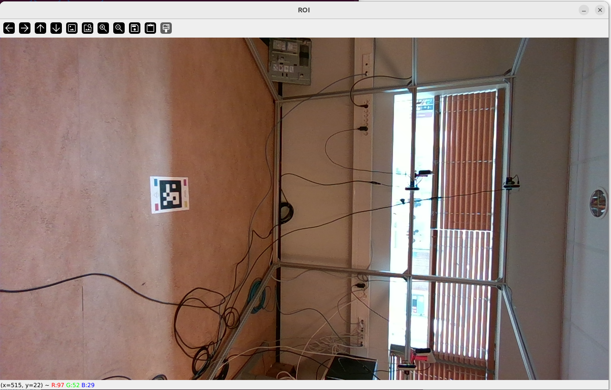
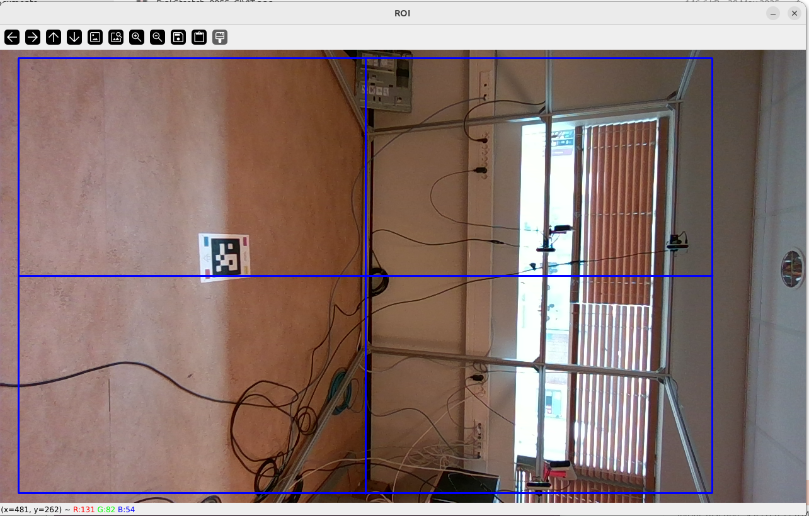
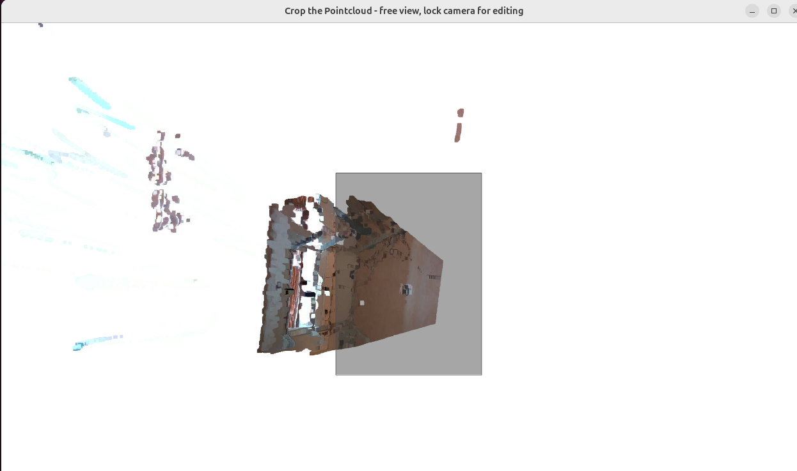
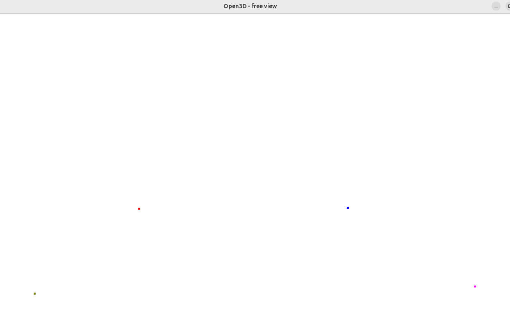

# uvgVoluCap

## Getting started

To build this project from source, you'll need to have vcpkg installed and added to your system's PATH environment variable. Here's how you can do it:

1. **Download vcpkg**: 
   - You can download vcpkg from its GitHub repository: [Microsoft/vcpkg](https://github.com/microsoft/vcpkg):
    ```
    git clone https://github.com/Microsoft/vcpkg.git
    ```
   - Setup executable file:
    ```
    cd vcpkg
    ./bootstrap-vcpkg.sh # bootstrap-vcpkg.bat for Powershell
    ./vcpkg integrate install
    ```
    At this point, vcpkg is set up and ready to use

2. **Add vcpkg to PATH**:

   - Add the directory containing the vcpkg executable to your system's PATH environment variable. This step allows you to run vcpkg from any directory in your command prompt or terminal.

3. **Preparing**:
    - Clone the main repository:
    ```
    git clone https://gitlab.tuni.fi/cs/ultravideo/pcc/uvgvolucap.git
    cd uvgvolucap
    ```

    - Initialize the submodules
    ```
    git submodule update --init --recursive
    ```

    - To Pull Updates Later:
    ```
    git submodule update --remote
    ```

4. **Build the project**:
    - Navigate to this project folder ( Same location with vcpkg-configuration.json file ).
    - Run the following command to build:
    ```
    mkdir build
    cd build
    cmake .. --preset=default
    cmake --build . --config Release --parallel --target install
    ```
    
After following these steps, you should be able to build the project successfully.

5. **Calibration**:
    + To run our method:
    ```
    cd /src/calibration
    python src/calibration/Calibrate.py
    ```
    If a camera is connected, a window of its color image will appera like this:
    
    

    Select the ROI - make sure it can conver most of the humnan body - Then press Space:

    

    Then a Window of 3D sence appear - Press K to lock - Select the aruco area - Press C to trim to sence - Press ESC to exit.
    Worth to note that: Focus only to the area containing the aruco, leave some details of the wall to recognize the correct surface to click later.

    

    Then repeat these steps for all connected cameras.
    After that, a sence of 4 points appears, Shift + click on this order: Pink - Blue - Red - Gray

    

    Then a 3D scene containing the aruco appear, click the color on the Aruco: Pink - Blue - Red - Gray. Then press ESC
    At this stage, the calibrated sence appears, the first sence has been to correct space/position. Now it will become the reference for other camera.
    Click Pink - Blue - Red - Gray on the reference sence. Then repeat same order for order sence and follow instruction on the terminal.

    + Use CWIPC method:

    Create an empty calib file:
    ```
    cwipc_register --noregister
    ```
    Run this to start calibrate, make sure the aruco is visible for all cameras:
    ```
    cwipc_register --nofine --rgb --interactive --verbose
    ```
    A Window of all view from all cameras appear then press W. Checking all view can detect the aruo marker. Then press ESC to finish.
    Now you have cameraconfig.json from CWIPC software. Go to /src/calibration to convert it to uvgVolucap format:
    ```
    cd /src/calibration
    python3 convert_calib.py --cwipc_calib_path /path/to/cwipc_cameraconfig.json --template ./template.json --output /path/to/uvgvolucap_calib.json
    ```

6. **Run capturing**:
    + Run Visualizer -> Switch to ZMQ mode -> Start listening:
    + Go to build/bin:
    ```
    ./uvgVoluCap --config /path/to/uvgvolucap_calib.json --addr_color tcp://localhost:5555 --addr_position tcp://localhost:5556 --running_time 60 --cam_type 2 --running_mode 0
    ```
    Note that: --addr_color tcp://localhost:5555 --addr_position tcp://localhost:5556 must be match with addresses on Visualizer.